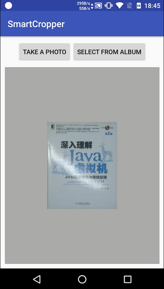
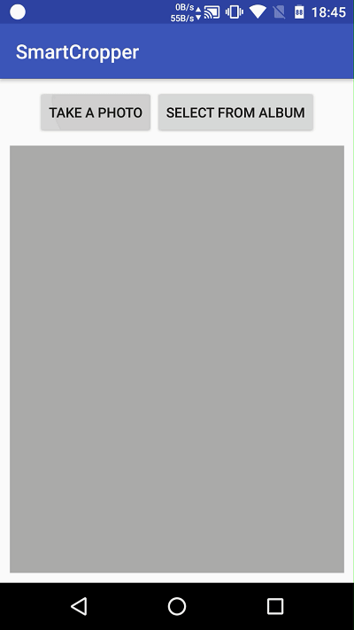

# SmartCropper

## English | [中文](README.md)

A library for cropping image in a smart way that can identify the border and correct the cropped image. Applicable to ID cards, business cards, documents and other photos of the crop. If you like, welcome start, fork or follow me.


## Features

- Crop image in a smart way that can identify the border.
- Support drag anchors, magnifying glass effect to enhance the positioning experience.
- Use the perspective transform to crop and correct the selection to restore the front image.
- Support rich UI settings, such as auxiliary lines, mask, anchor, magnifying glass and so on.

## Sample（[link](art/SmartCropperSampleV5.apk)）

### 1. Select a image, use the perspective transform to crop and correct the selection:




### 2. drag anchors, magnifying glass effect to enhance the positioning experience:


### gif：




## Import

Step 1. Add it in your root build.gradle at the end of repositories:
```
	allprojects {
		repositories {
			...
			maven { url 'https://jitpack.io' }
		}
	}
```

Step 2. Add the dependency
```
	dependencies {
	        compile 'com.github.pqpo:SmartCropper:V1.0.1'
	}
```

note：

```
-keep class me.pqpo.smartcropperlib.**{*;}
```  

## Usage  

### 1. Use CropImageView in your xml file.  
```xml
<me.pqpo.smartcropperlib.view.CropImageView   
        android:id="@+id/iv_crop"  
        android:layout_width="match_parent" 
        android:layout_height="match_parent" />  
```  

note： CropImageView extends from ImageView，and ScaleType must be center type，If you set ScaleType to fit_end,fit_start,matrix will throws an error。  

### 2. Set image to crop：    

```java
ivCrop.setImageToCrop(selectedBitmap); 
```

It will identify the border by native(c/c++), and show Image.     

### 3. Crop the image：

```java  
Bitmap crop = ivCrop.crop();  
```  

## Features

- [x] Optimization point sorting algorithm
- [x] CropImageView selection magnifying effect
- [x] CropImageView xml settings
- [ ] Optimization of intelligent selection algorithm
- [ ] Please submit ISSUEs

---

## Author：

- Email：    pqponet@gmail.com
- GitHub：  [pqpo](https://github.com/pqpo)
- Blog：    [pqpo's notes](https://pqpo.me)
- Twitter: [Pqponet](https://twitter.com/Pqponet)
- WeChat: pqpo_me


License
-------

    Copyright 2017 pqpo

    Licensed under the Apache License, Version 2.0 (the "License");
    you may not use this file except in compliance with the License.
    You may obtain a copy of the License at

       http://www.apache.org/licenses/LICENSE-2.0

    Unless required by applicable law or agreed to in writing, software
    distributed under the License is distributed on an "AS IS" BASIS,
    WITHOUT WARRANTIES OR CONDITIONS OF ANY KIND, either express or implied.
    See the License for the specific language governing permissions and
    limitations under the License.


